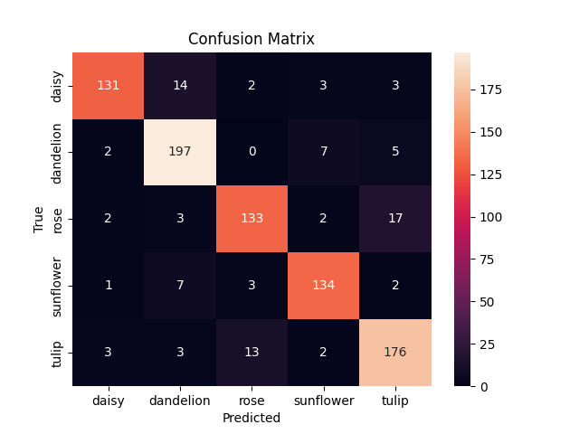
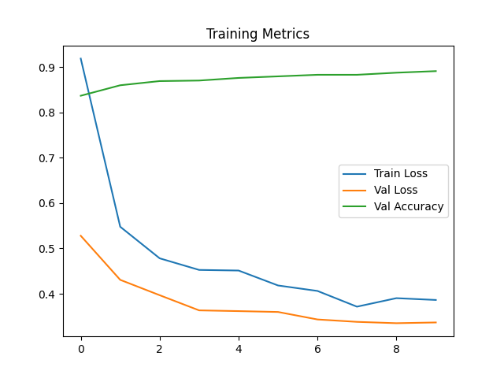

# 🌸 Flower Classification App

A deep learning application that classifies flower images into five categories (daisy, dandelion, rose, sunflower, and tulip) using transfer learning with ResNet50 architecture.


*Note: If the images are not displaying, they can be found in the `ui` directory.*

## 📋 Table of Contents

- [Overview](#overview)
- [Features](#features)
- [Project Structure](#project-structure)
- [Model Architecture](#model-architecture)
- [Installation](#installation)
- [Usage](#usage)
- [Results](#results)
- [UI Screenshots](#ui-screenshots)
- [Future Improvements](#future-improvements)

## 🔍 Overview

This project implements a flower classification system using deep learning techniques. The application provides a user-friendly web interface built with Streamlit where users can upload flower images and get instant classification results with confidence scores.

## ✨ Features

- **Image Classification**: Identify 5 different flower types with high accuracy
- **Interactive UI**: User-friendly interface with drag-and-drop image upload
- **Confidence Visualization**: Bar charts showing prediction confidence for each class
- **Sample Images**: Reference images for each flower category
- **Responsive Design**: Works well on different screen sizes

## 📁 Project Structure

```
flower_classification/
├── data/                      # Training and validation data
│   └── flowers_split/         # Split dataset for training/validation
├── flowers/                   # Sample flower images by category
│   ├── daisy/
│   ├── dandelion/
│   ├── rose/
│   ├── sunflower/
│   └── tulip/
├── mlruns/                    # MLflow experiment tracking data
├── outputs/                   # Model outputs and visualizations
│   ├── confusion_matrix.png   # Confusion matrix visualization
│   ├── features.npy           # Extracted features
│   ├── output.png             # Sample output
│   └── training_plot.png      # Training/validation loss curves
├── samples/                   # Sample images for testing
├── ui/                        # UI screenshots
├── flower_app.py              # Streamlit web application
├── flower_clasification_with_transferlearning.ipynb  # Training notebook
├── requirements.txt           # Project dependencies
└── README.md                  # Project documentation
```

## 🧠 Model Architecture

The flower classification model uses transfer learning with a pre-trained ResNet50 architecture:

```
ResNet50 (Pretrained on ImageNet)
│
├── Feature Extraction Layers (Frozen)
│   └── Convolutional layers extracting visual features
│
└── Custom Classifier Head
    ├── Global Average Pooling
    ├── Dropout (0.5) for regularization
    ├── Fully Connected Layer (2048 → 512)
    ├── ReLU Activation
    ├── Dropout (0.3)
    └── Output Layer (512 → 5 classes)
```

### Image Preprocessing

- Resize to 224×224 pixels
- Convert to RGB format
- Normalize with ImageNet mean and standard deviation
- Data augmentation during training:
  - Random horizontal and vertical flips
  - Random rotation
  - Color jitter

## 🔧 Installation

1. Clone the repository:

```bash
git clone https://github.com/yourusername/flower-classification.git
cd flower-classification
```

2. Install dependencies:

```bash
pip install -r requirements.txt
```

## 🚀 Usage

1. Run the Streamlit app:

```bash
streamlit run flower_app.py
```

2. Open your browser and navigate to the URL shown in the terminal (typically http://localhost:8501)
3. Upload a flower image using the file uploader
4. Click the "Classify Flower" button to get predictions

## 📊 Results

The model achieves high accuracy on the test set, with particularly strong performance on sunflowers and daisies.

### Confusion Matrix


*Confusion matrix showing model performance across flower categories*

### Training Progress


*Training and validation loss/accuracy curves*

## 📱 UI Screenshots

### Main Interface


*Sample flower display showing the horizontal flower categories*

### Upload Interface


*Image upload interface with drag and drop functionality*

### Classification Results


*Classification result showing prediction and confidence*

### Confidence Visualization


*Bar chart visualization of confidence scores for each flower category*

## 🔮 Future Improvements

- Expand the dataset to include more flower varieties
- Implement model explainability with Grad-CAM visualizations
- Add mobile support with responsive design
- Integrate with a mobile app for on-device classification
- Implement batch processing for multiple images

## 📝 License

This project is licensed under the MIT License - see the LICENSE file for details.

## 🙏 Acknowledgments

- The dataset is based on the [Flowers Recognition](https://www.kaggle.com/alxmamaev/flowers-recognition) dataset from Kaggle
- Thanks to the PyTorch and Streamlit communities for their excellent documentation and tools
